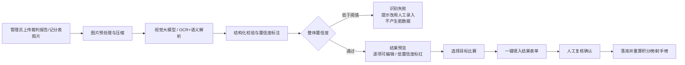

# 绿茵BIT · AI 识图技术方案

## 1. 产品流程（与 PRD 验收一致）



## 2. 服务端实现

代码位于 `server/src/services/aiRecognition.js`，采用 **Provider 抽象**：

| 模式 | 触发条件 | 行为 |
|---|---|---|
| `demo` 演示识别 | 未配置 API Key | 返回 PRD 固定示例结构，方便离线演示与联调 |
| `vision` 视觉模型 | 配置 `AI_VISION_API_KEY` | 调用 OpenAI 兼容多模态接口（gpt-4o / qwen-vl-max / GLM-4V 等）|

### 识别 Prompt 设计要点

- 系统提示词内置**结构化 JSON Schema**（对阵、双方首发/替补（号码+姓名）、比赛服颜色、比分、进球+号码+时间+点球标记、换人（上/下场号码与时间）、红黄牌+号码、裁判名单、逐字段置信度）。
- 传入**候选球队名单**，只允许同音/简写纠错，禁止联想补全，从源头减少幻觉。
- 要求模型“图上没有就不写”，无法判断的字段输出空值并把置信度调低。
- 支持**多图互补**（记分表 + 比分照片），逐图阅读再合并。

### 服务端防护

- 只接受 JPG/PNG，单张 ≤ 12MB，最多 6 张；前端上传前压缩到 1600px，降低带宽与 token 成本。
- 识别结果必须通过服务端 schema 校验：比分非负整数、进球名单数量与比分一致、牌型枚举、号码与姓名成对、双方能在候选球队中定位；不满足即报“识别失败，请改用人工录入”。
- 输出 `confidence`（整体/比分/进球/换人/红黄牌/裁判），整体 < 0.4 直接失败；字段 < 0.75 前端标红强制人工复核。
- 未确认前不写任何库表；只有管理员点击“提交结果”才落库并触发榜单重算。
- 每次识别写 `audit_log`（操作人、图片数、Provider、赛事）。

## 3. 真实模型接入示例

复制 `.env.example` 为 `.env`（或设置系统环境变量）：

```bash
# 阿里云百炼（通义千问视觉）
AI_VISION_BASE_URL=https://dashscope.aliyuncs.com/compatible-mode/v1
AI_VISION_MODEL=qwen-vl-max
AI_VISION_API_KEY=sk-xxxxxxxx

# 或 OpenAI
AI_VISION_BASE_URL=https://api.openai.com/v1
AI_VISION_MODEL=gpt-4o
AI_VISION_API_KEY=sk-xxxxxxxx
```

重启服务后，页面 AI 入口自动变为“真实视觉模型”，上传真实裁判报告即可识别。

## 4. 生产级选型建议（面试可展开）

| 环节 | 推荐方案 | 原因 |
|---|---|---|
| OCR | 腾讯云/阿里云 OCR 或 PaddleOCR 自建 | 手写、倾斜、模糊场景有专项优化 |
| 语义解析 | 视觉大模型结构化输出（qwen-vl-max / GLM-4V）| 比分表语义理解强 |
| 混合策略 | OCR 出候选文本 → 大模型只做结构化，置信度更高 | 降低幻觉、成本可控 |
| 人工复核 | 低置信度字段强制修改后落库 | 与产品规则一致，防止脏数据 |
| 效果评测 | 建立 200 张标注集，统计字段级准确率 | 对应 PRD 成功指标“AI 识别有效率 ≥80%” |

## 5. 开放问题映射

- PRD Q6（识别准确率、手写覆盖）→ 需要真实标注集与模型评测，代码层已预留 provider、置信度与人工复核全链路。
- 正式版建议把图片存入对象存储（腾讯云 COS / 阿里云 OSS），`files` 表只存 URL 与元数据；当前演示库以 `dataUrl` 传入并在服务端校验，内存级处理。
